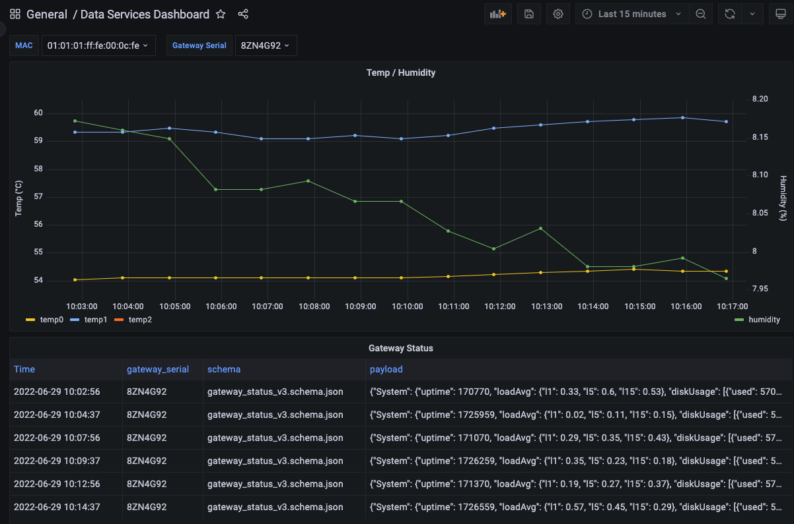

# Everactive Data Services Example

This repository contains a multi-container Docker Compose environment to receive, store and review Eversensor time series readings. 

NOTE: This project is intended as a tool to for evaluating Everactive's Data Services; it is not a production-ready sample.

The environment has three main components that make use of open-source development tools:

- A [Node.js](https://nodejs.org) [Express](https://developer.mozilla.org/en-US/docs/Learn/Server-side/Express_Nodejs/Introduction#web_frameworks) application webhook that receives Eversensor readings.
- A [TimescaleDB](https://timescale.com) PostgreSQL database to store the Eversensor readings in a time-series hypertable.
- A [Grafana](https://grafana.com) application to provide a dashboard for the time series data.

## Webhook Application

The webhook application is an [Express](https://www.npmjs.com/package/express) application that exposes three endpoints. By default the webhook application uses port 4440. This can be changed in the `docker-compose.yml` configuration file.

| Webhook endpoint | Description |
|:----------------|:---------------|
|`POST /` | The sensor readings webhook endpoint. Each Eversensor reading received is stored in the postgres `sensor_readings` table. |
|`POST /gateway_status` | The gateway status webhook endpoint. Each Gateway Status payload received is stored in the postgres `gateway_status` table. |
|`GET /` | Returns the last ten messages received. |
|`GET /health` | Returns a simple 200 status code if the application is running successfully.|

**Authorization:** To prevent invalid requests to the webhook application, the `POST` and `GET /` endpoints require a header `x-api-key` for authorization. The value for this header is set via the `API_KEY` environment variable in the `docker-compose.yml` config file. It is set to `secret_key` by default. All requests to these two endpoints must include the `x-api-key` header with the correct value or a 401 (Unauthorized) status code is returned.

**Duplicate Entries:** In some circumstances, it's possible for webhook publishers to send duplicate entries to webhook receivers. When it receives a duplicate entry, the app returns a 304 (Not Modified) status code, and does not store the duplicate reading in the `sensor_readings` table. If the webhook receiver receives some other error from the postgres database, it returns a 400 (Bad Request) status code to the webhook publisher.

**HTTPS:** When running locally, the webhook is exposed as an HTTP connection. Everactive's webhook publishers require HTTPS connections to all webhook receivers. To expose the local application to the public internet and provide a secure HTTPS connection, we recommend using [localtunnel](https://www.npmjs.com/package/localtunnel) or [ngrok](https://ngrok.com/).

### Database configuration

A [TimescaleDB](https://www.timescale.com/) Postgres instance is used to store the sensor readings and gateway status messages in 2 Timescale hypertables named `sensor_readings` and `gateway_status`.

- The database exposes port 4441 to connect using a Postgres client. 
- The `docker-compose.yml` configuration file sets the postgres user / password to `postgres` / `postgres`. If you modify these values, you must also make the same changes to the Grafana and Node database connection values.
- The tables are created when the container is started, using the SQL script `./timeseries-db/initdb.d/create_tables.sql`.

### Data visualization dashboard

A [Grafana](https://grafana.com) dashboard is provided that shows temperature and humidity readings for each sensor the webhook has received at least one reading from.

- View the dashboard by browsing to `http://localhost:4442`. 
- The default username / password when first logging in is `admin` / `admin`.

## Using the Sample

To use this sample application you must have [Docker](https://docker.com) installed, and [Everactive API credentials](https://support.everactive.com/hc/en-us/articles/6279483691159-Creating-Your-First-API-Credential) to create a webhook.

By default, the webhook runs on port 4440 by default and the Grafana application runs on port 4442. 
To change the default ports, edit the `docker-compose.yml` file.

To use the sample, take the following steps:

1. Clone this repository.
- Start the Docker environment:
  ```
  docker-compose up -d
  ```

2. Create an HTTPS tunnel to the webhook. We recommend using [localtunnel](https://www.npmjs.com/package/localtunnel) with `npx` (if you have `node` installed), or [ngrok](https://ngrok.com/).
  ```sh
  npx localtunnel --port 4440
  # alternatively:
  ngrok http 4440
  ```

3. Register a sensor reading webhook with Everactive using the following request, inserting your own URL and credential values:

  ```
  curl -v -X POST 'https://api.data.everactive.com/ds/v1/webhooks \
  -H `Authorization: Bearer {{access_token}}' \
  -H 'Content-Type: application/json' \
  -d '{"callbackUrl": "https://[your sample webhook url]", "eventType": "sensor_reading", "enabled": true, "headers": [{"key": "x-api-key", "value": "secret_key"}]}'
  ```

  The webhook should start receiving Eversensor readings within the next few minutes. Each reading is saved in a time-series postgres table `sensor_readings`.

4. Optionally, you can also register a gateway-status webhook with Everactive using the following command:

  ```
  curl -v -X POST 'https://api.data.everactive.com/ds/v1/webhooks \
  -H `Authorization: Bearer {{access_token}}' \
  -H 'Content-Type: application/json' \
  -d '{"callbackUrl": "https://[your sample webhook url]/gateway_status", "eventType": "gateway_status", "enabled": true, "headers": [{"key": "x-api-key", "value": "secret_key"}]}'
  ```

5. Verify that the webhook is receiving data. It can take a few minutes before data is flowing.
  ```
  curl -v -X GET 'http://localhost:4440 \
  -H `x-api-key: secret_key`'
  ```

6. Once the webhook is registered and receiving data, use the Grafana application to view the data. 
- The Grafana application is available at `http://localhost:4442`
- The initial login username / password is `admin` / `admin`. 

  A default dashboard is included in the Grafana application. It shows temperature and humidity readings as they are received. If you configured a gateway-status webhook subscription, you also see a table with gateway status messages.


